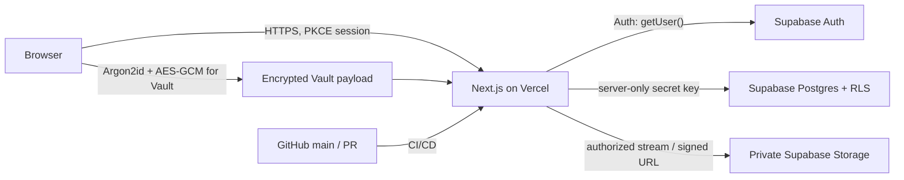
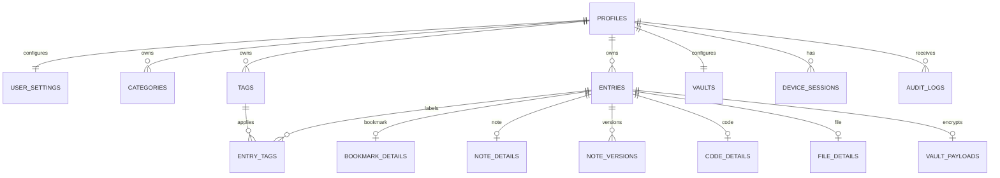

# Personal Digital Vault — Foundation Architecture

## Decisions locked for the foundation

| Concern | Decision |
| --- | --- |
| Web application | Next.js 16 App Router + TypeScript on Vercel |
| Identity | Supabase Auth: email/password, mandatory email confirmation, PKCE cookie session |
| Data | Supabase Postgres; all application tables have RLS and ownership predicates |
| Files | Supabase Storage private bucket `vault-files`; no public object URL or browser Storage policy |
| Data access | Next.js backend-for-frontend routes/Server Actions; browser does not receive table or Storage access grants |
| Vault | Client-side Argon2id key derivation + AES-256-GCM encryption; server stores ciphertext, nonces, salt, KDF parameters, and wrapped key only |
| Source/deploy | GitHub is the source of truth; Vercel deploys Preview per PR and Production from `main` |

## System boundary



## Data model

`entries` is the owner-scoped, unified library record. Type-specific tables (`bookmark_details`, `note_details`, `code_details`, `file_details`) keep each module clean while allowing one search, favorite, pin, archive, trash, category, and tag model.

`vault_payloads` is intentionally separate. Vault plaintext—including passwords, API keys, recovery codes, and confidential titles—never enters Postgres. Only a client-generated ciphertext payload and AES-GCM nonce are stored.



## Security levels

| Level | Stored where | Access rule |
| --- | --- | --- |
| `standard` | Typed record in Postgres | Confirmed session + ownership |
| `private` | Typed record in Postgres | Ownership + fresh re-authentication grant |
| `vault` | `vault_payloads` ciphertext / encrypted Storage bytes | Ownership + active Vault unlock (client-side key) |
| `step_up` | As above | Ownership + Vault where relevant + recent password/TOTP/passkey verification |

## Authentication and login safety

1. Use Supabase hosted Auth with email confirmation enabled; reject unconfirmed users in `requireUser`.
2. Use `@supabase/ssr` PKCE cookies. `src/proxy.ts` refreshes them and every request is `private, no-store`; authenticated pages must stay dynamic.
3. Each data route validates the session with `auth.getUser()`, derives `owner_id` from the server-verified user, and never accepts an owner ID from the client.
4. Password resets and account-level password storage remain in Supabase Auth. Do not create a password column in `public`.
5. Add TOTP MFA before enabling Vault in the user interface. Recovery codes are only displayed once and are never logged.
6. Perform re-authentication for private/step-up reads, Vault unlock/reset, export/restore, account email/password change, disabling MFA, permanent deletion, and session revocation.
7. Implement login/risk limits in a server route plus Vercel WAF/rate limits: per-IP and per-account, exponential backoff after 3 failures, CAPTCHA escalation, and audited security notifications.
8. Use server-only `SUPABASE_SECRET_KEY` only in privileged route handlers. Never expose it, a JWT signing key, Vault key, or recovery code through `NEXT_PUBLIC_` variables, browser storage, source control, or logs.
9. Before production, replace the initial compatibility CSP with a nonce-based CSP in `proxy.ts`; keep third-party scripts off authenticated routes.

## Vault cryptography contract

* The browser derives a key-encryption key from the independent Vault password using Argon2id with a per-user random salt and stored parameters.
* It generates a random vault data-encryption key and wraps it with AES-256-GCM. Postgres stores only the wrapped key, salt, parameters, nonce, and version.
* Every Vault record and encrypted file uses a new random 96-bit AES-GCM nonce and authenticated associated data including its immutable entry ID and encryption version.
* The unwrapped key exists only in memory while the Vault is unlocked; it is cleared on timeout, lock, logout, tab close/page hidden, and after sensitive copy/reveal.
* A forgotten Vault password cannot be recovered by an administrator. “Reset Vault” deletes encrypted Vault data only after explicit re-authentication.

## Repository layout

```text
vault-app/
├─ src/app/                 # routes, pages, route handlers
├─ src/lib/supabase/         # browser/server clients
├─ src/lib/security/         # session, re-auth, authorization, crypto contracts
├─ supabase/migrations/      # schema is versioned beside code
├─ docs/                     # architecture and runbooks
├─ .env.example              # names only, never secrets
└─ package-lock.json         # reproducible dependency graph
```

## Deployment contract

* `main` → Vercel Production; pull requests → isolated Vercel Preview.
* Keep Production, Preview, and Development Supabase credentials distinct. Preview must not point at production data.
* Add `NEXT_PUBLIC_SUPABASE_URL`, `NEXT_PUBLIC_SUPABASE_PUBLISHABLE_KEY`, `SUPABASE_SECRET_KEY`, and `NEXT_PUBLIC_APP_URL` in Vercel per environment.
* Apply database migrations through a reviewed GitHub workflow/CI identity—not manually from the browser—after the Supabase connector is authorized.

## Build order

1. Foundation (this change): schema, RLS, private Storage, SSR session plumbing, headers.
2. Authentication UI: sign-up, confirmation, login, password reset, TOTP, re-auth.
3. Library core: categories, tags, bookmarks, notes, search, archive/trash.
4. File pipeline: MIME/size checks, malware-scan integration, private upload/download/preview.
5. Vault: client crypto, auto-lock, encrypted payloads/files, sensitive clipboard.
6. Security center: sessions, devices, audit, alerts, export/backup/restore, passkeys.
